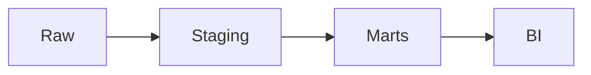
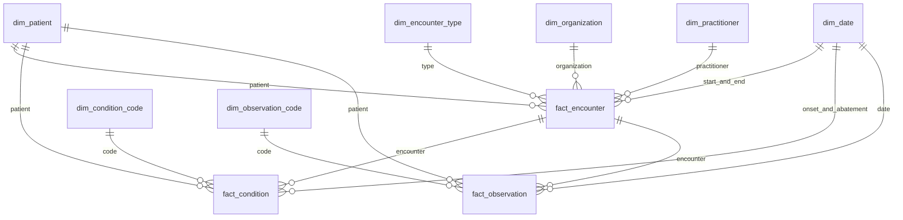

# Synthea FHIR pipeline

I built a small pipeline that turns Synthea FHIR R4 bundles into a star schema and a few clinical charts. Python extracts the resources I need into Parquet. dbt models that Parquet in a single DuckDB file, and Streamlit reads the warehouse read-only.

The input is the Synthea "100 Sample Synthetic Patient Records, FHIR R4" zip.

## Quick start

### Docker

From the repository root:

```bash
docker compose up --build
```

That runs `scripts/docker_entrypoint.sh`: download, extract, `dbt build`, then Streamlit on port 8501. Open http://localhost:8501.

`data/` and `warehouse/` are mounted from the host. A second `docker compose up` skips the download if the JSON files are already there, re-runs the extract and dbt, and starts the app again.

### Local

You need Python 3.11, `make`, and `bash` (Git Bash is enough on Windows).

```bash
python -m venv .venv
source .venv/bin/activate
pip install -r requirements.txt
make all
make app
```

On Windows, activate the venv with `.venv\Scripts\activate` and run `make` from a shell that provides `bash`.

`make all` does not use Docker. It downloads the sample, extracts Parquet, runs the dbt models (`make transform`), then runs pytest and `dbt test` (`make test`). `make app` starts Streamlit on port 8501. Docker uses `dbt build` (models and dbt tests) and does not run pytest.

## Assumptions

The brief's page-2 heading says "Stack Overflow Annual Developer Survey". That looks like a leftover from a template. I used the Synthea data described in the rest of the brief.

The sentence that starts "produce an…" is cut off. I read it as: produce an analysis of the data, with a small dashboard on top of a modelled warehouse.

Synthea publishes this sample as CSV and as FHIR. I used the FHIR R4 JSON bundles, because the task is to ingest FHIR and the references between resources are explicit there.

## Architecture



Raw is the downloaded bundles. I leave them as Synthea wrote them.

Staging is a Python extract. One file is read at a time and written to a typed Parquet file per resource. There is no business logic here, only flattening and types.

Marts are the star schema. dbt staging views cast and trim the Parquet. Dimension and fact tables in `warehouse/fhir.duckdb` hold the grain, keys, and measures.

BI is a Streamlit app with a read-only connection to that DuckDB file.

## Data model



Every dimension has an unknown member so a fact foreign key is never null. For string keys that member is `'-1'`. For `dim_date.date_key` it is the integer `-1`, because that key is `YYYYMMDD`.

| Fact | Grain |
| --- | --- |
| `fact_encounter` | One row per encounter |
| `fact_condition` | One row per recorded condition |
| `fact_observation` | One row per observation value. A panel such as blood pressure is already one row per component. |

`rpt_bmi_by_gender_age` is not part of the star. It is one row per gender and age bracket, built from `fact_observation`.

## Key design decisions and trade-offs

**DuckDB rather than Postgres or a cloud warehouse.** The data is one sample that fits on a laptop. DuckDB is a single file, which dbt and Streamlit can both open, and it reads Parquet directly. I would not start here if several writers had to load the warehouse at once.

**Hash surrogate keys rather than raw FHIR ids.** `patient_key` and `encounter_key` are `md5` of the FHIR id. Organization and practitioner keys are `md5` of the identifier the encounter actually references (Synthea's organization id, and the NPI), which is not the FHIR resource id. The hash gives every dimension the same kind of key. The cost is that the key is not readable and a collision, while unlikely, would be silent.

**Unknown members instead of null foreign keys.** If a fact cannot find a patient, organization, date, or encounter, the key is `'-1'` (or `-1` for dates). Joins still succeed. The trade-off is that "missing" is a real row I have to remember to filter, and the encounter link on conditions and observations points at `fact_encounter`, which has no unknown row. Those tests ignore `'-1'`.

**Age at the event, not on the patient.** `dim_patient` has birth date and no age column. Each fact computes completed whole years from birth date to that fact's event date, in UTC. A stored age would be wrong the next day.

**SCD Type 1 for now.** A new extract overwrites the current patient, organization, and practitioner attributes. I do not keep address history. That is enough for this sample. A production feed of the same patient over time needs Type 2.

**Condition to encounter.** A condition can point at the encounter where it was recorded. I keep that as `encounter_key`. If the encounter is missing, the key is `'-1'` and `duration_days` stays null when there is no abatement. Onset and abatement are dates, not a substitute for the encounter.

**Observation components.** Blood pressure is one Observation with two components. I emit one staging row per component, with its own code and value, and `parent_observation_id` set to the panel. The fact grain follows those rows. Profile counts and extracted counts will not match for Observation, and that is expected.

**BMI averaged per patient first.** `rpt_bmi_by_gender_age` averages a patient's BMI readings inside an age bracket, then averages those patient means. Otherwise a patient with many visits dominates the bracket. The 0-17 band is only a rough figure: paediatric BMI is normally a percentile, and I did not use LOINC `59576-9`.

## Data quality

pytest (`tests/test_fhir_utils.py`) covers nested path access, the three FHIR reference forms Synthea uses, and splitting a blood-pressure observation into component rows.

dbt tests, in `dbt/models/marts/schema.yml` and `dbt/tests/`:

- `unique` and `not_null` on every surrogate key
- `not_null` and `relationships` from each fact foreign key to its dimension
- `encounter_key` on the condition and observation facts must exist on `fact_encounter`, except the unknown value `'-1'`
- `accepted_values` for gender (`male`, `female`, `other`, `unknown`), encounter class (`AMB`, `EMER`, `HH`, `IMP`, `VR`), and BMI age bracket
- no encounter with `end_ts` before `start_ts`
- BMI ratio (LOINC `39156-5`) between 10 and 80

The extract writes `docs/extract_reconciliation.md`. It compares resource counts in the bundles with rows written to Parquet. Observation is higher when component rows are expanded, and that difference is called out in the report.


## Productionising

I would orchestrate this with Dagster or Airflow: one asset or task per stage, with the Parquet files and the DuckDB (or warehouse) load as explicit dependencies. Retries belong on download and extract, not on a second Streamlit process writing the same file.

Loads should be incremental. FHIR `meta.lastUpdated` is the watermark I would store per resource type. The first run is a full extract. Later runs request or select resources changed since that timestamp and merge them. The current job rereads every bundle and overwrites Parquet.

I would partition staging Parquet and large fact tables by event date (month is enough at this volume). That keeps a backfill to one partition.

Raw JSON would land in object storage. The warehouse would be Snowflake or BigQuery once more than one person is querying it or the history no longer fits a file. dbt stays; the profile changes. DuckDB is the local stand-in, not the production store.

Extraction is one process and it holds the flattened rows until the end so it can drop duplicate ids. For a larger feed I would write Parquet per file and deduplicate in the warehouse, and run files in parallel.

Patient address, organization, and practitioner would become SCD Type 2, with an effective date taken from the bundle or from `meta.lastUpdated`. Facts would point at the row that was current at the event time.

This sample is synthetic, so there is no real PHI. A production feed of the same shape would need encryption at rest and in transit, access by role, an audit log of who queried patient-level facts, and de-identification before a wide analyst warehouse. The Streamlit role I have in mind is aggregated charts, not a row-level patient browser.

CI would run pytest and `dbt build` on every change. `dbt build` is what the container already runs after extract.
